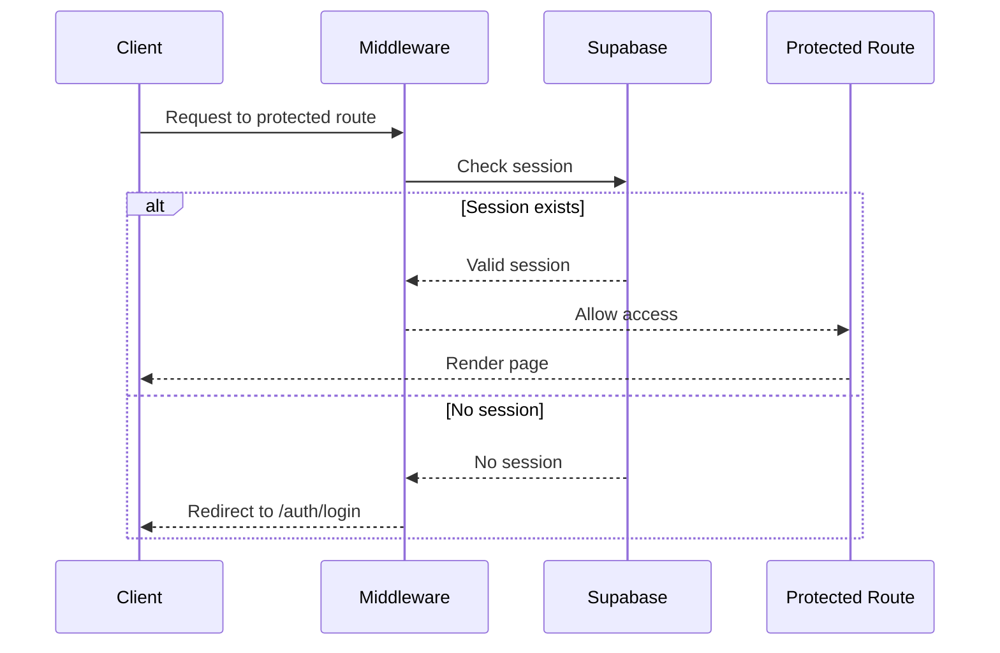
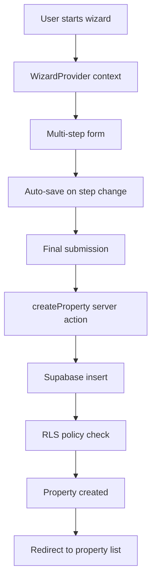
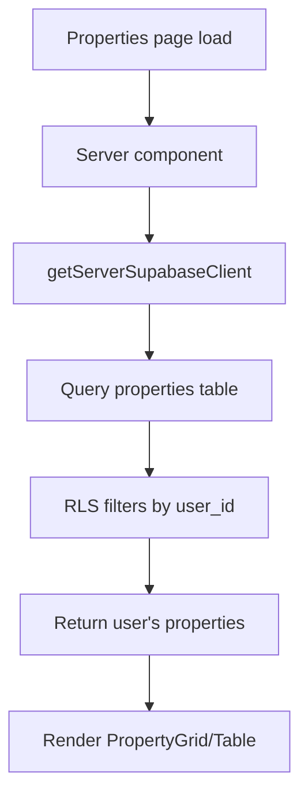
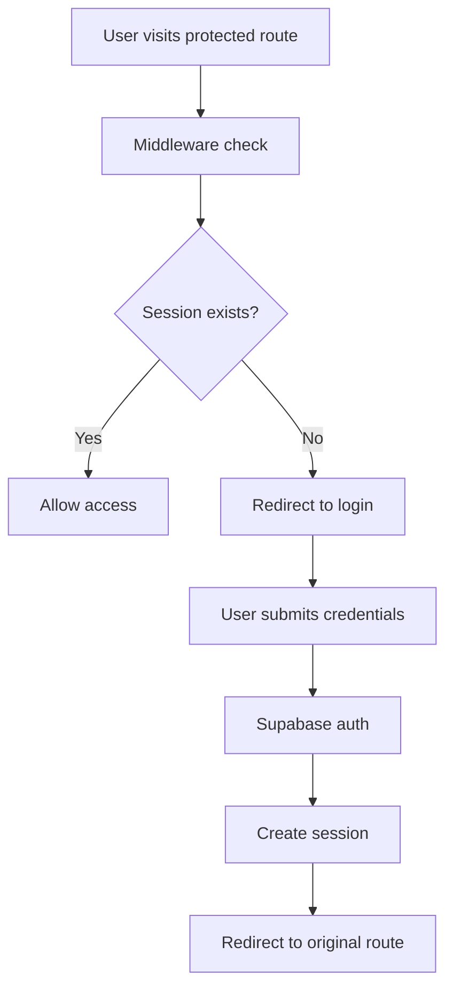

# Propsync API Documentation & Data Flow

This document outlines the API endpoints, server actions, and data flow patterns in the Propsync property management application.

## Architecture Overview

Propsync uses **Next.js Server Actions** instead of traditional REST API endpoints. This provides:
- Type-safe server-side operations
- Automatic request/response handling
- Built-in CSRF protection
- Seamless integration with React components

## Authentication & Authorization

### Authentication Flow



### Authentication Routes

| Route | Purpose | Component |
|-------|---------|----------|
| `/auth/login` | User login/signup | `AuthForm` |
| `/auth/reset-password` | Password reset | Password reset form |
| `/auth/update-password` | Password update | Password update form |

### Authentication Server Actions

**File**: `components/auth/auth-form.tsx`

```typescript
// Login
const { error } = await supabase.auth.signInWithPassword({
  email,
  password,
})

// Signup
const { error } = await supabase.auth.signUp({
  email,
  password,
  options: {
    data: {
      full_name: fullName,
    },
  },
})

// Logout
const { error } = await supabase.auth.signOut()
```

### Middleware Protection

**File**: `middleware.ts`

- **Protected Routes**: All routes except `/auth/*`, `/api/*`, and `/`
- **Redirect Logic**: Unauthenticated users → `/auth/login?redirectTo=<original-path>`
- **Session Management**: Automatic session refresh and validation

## Server Actions (API Endpoints)

### Property Management Actions

**File**: `app/actions/property-actions.ts`

#### 1. Create Property
```typescript
export async function createProperty(formData: WizardFormData)
```
- **Purpose**: Create a new property with comprehensive details
- **Input**: `WizardFormData` (100+ fields across 8 categories)
- **Output**: Property ID and success status
- **Security**: User-scoped via RLS

#### 2. Update Property
```typescript
export async function updateProperty(propertyId: string, formData: WizardFormData)
```
- **Purpose**: Update existing property details
- **Input**: Property ID + updated form data
- **Output**: Success status
- **Security**: User-scoped via RLS

#### 3. Load Property for Edit
```typescript
export async function loadPropertyForEdit(propertyId: string)
```
- **Purpose**: Fetch property data for editing
- **Input**: Property ID
- **Output**: Complete property data formatted for wizard
- **Security**: User-scoped via RLS

#### 4. Delete Property
```typescript
export async function deleteProperty(propertyId: string)
```
- **Purpose**: Soft delete a property
- **Input**: Property ID
- **Output**: Success status
- **Security**: User-scoped via RLS

### Database Setup Actions

**File**: `app/actions/auth-setup.ts`

#### Setup Authentication Tables
```typescript
export async function setupAuthTables()
```
- **Purpose**: Initialize database schema
- **Input**: None
- **Output**: Success/error status
- **Security**: Admin-only operation

**File**: `app/actions/setup-database.ts`

#### Setup Database Schema
```typescript
export async function setupDatabase()
```
- **Purpose**: Create all necessary tables and policies
- **Input**: None
- **Output**: Setup status
- **Security**: Admin-only operation

### Seeding Actions

**File**: `app/actions/seed-actions.ts`

#### Seed Sample Property
```typescript
export async function seedSampleProperty()
```
- **Purpose**: Insert sample property data for development
- **Input**: None
- **Output**: Success status
- **Security**: Uses service role key to bypass RLS

**File**: `app/actions/direct-seed.ts`

#### Direct Database Seeding
```typescript
export async function directSeed()
```
- **Purpose**: Direct database seeding with admin privileges
- **Input**: None
- **Output**: Detailed seeding results
- **Security**: Service role access

### Team Management Actions

**File**: `app/actions/team-actions.ts`

#### Get Team Members
```typescript
export async function getTeamMembers()
```
- **Purpose**: Fetch team members with property counts
- **Input**: None
- **Output**: Array of team member objects
- **Security**: Admin client with fallback to mock data

### Storage Setup Actions

**File**: `app/actions/storage-setup.ts`

#### Setup Storage Buckets
```typescript
export async function setupStorageBuckets()
```
- **Purpose**: Create Supabase storage buckets for file uploads
- **Input**: None
- **Output**: Setup status
- **Security**: Admin-only operation

## Data Flow Patterns

### 1. Property Creation Flow



### 2. Property Listing Flow



### 3. Authentication Flow



## Database Schema & RLS Policies

### Core Tables

#### Users Table
```sql
CREATE TABLE users (
  id UUID PRIMARY KEY REFERENCES auth.users(id),
  email TEXT NOT NULL UNIQUE,
  full_name TEXT NOT NULL,
  role TEXT DEFAULT 'readonly',
  created_at TIMESTAMP WITH TIME ZONE DEFAULT NOW()
);
```

#### Properties Table
```sql
CREATE TABLE properties (
  id UUID PRIMARY KEY DEFAULT uuid_generate_v4(),
  user_id UUID REFERENCES users(id),
  property_reference TEXT NOT NULL,
  building_name TEXT NOT NULL,
  -- ... other fields
  safety_security JSONB,
  kitchen_dining JSONB,
  bedrooms_bathrooms JSONB,
  technology JSONB,
  practical_living JSONB,
  location_lifestyle JSONB,
  accessibility_sustainability JSONB
);
```

### Row Level Security (RLS) Policies

#### Properties Table Policies
```sql
-- Users can only see their own properties
CREATE POLICY "Users can view own properties" 
  ON properties FOR SELECT 
  USING (user_id = auth.uid());

-- Users can only insert properties for themselves
CREATE POLICY "Users can insert own properties" 
  ON properties FOR INSERT 
  WITH CHECK (user_id = auth.uid());

-- Users can only update their own properties
CREATE POLICY "Users can update own properties" 
  ON properties FOR UPDATE 
  USING (user_id = auth.uid());

-- Users can only delete their own properties
CREATE POLICY "Users can delete own properties" 
  ON properties FOR DELETE 
  USING (user_id = auth.uid());
```

## Client-Side Data Access

### Supabase Client Configuration

**File**: `lib/supabase/client.ts`
```typescript
// Client-side Supabase client
export const getSupabaseClient = () => {
  return createClientComponentClient<Database>()
}

// Get current user role
export async function getUserRole(): Promise<string | null>

// Get current user details
export async function getCurrentUser()
```

**File**: `lib/supabase/server.ts`
```typescript
// Server-side client (respects RLS)
export const getServerSupabaseClient = async () => {
  return createServerComponentClient<Database>({ cookies })
}

// Admin client (bypasses RLS)
export const getAdminSupabaseClient = async () => {
  return createServerComponentClient<Database>({
    cookies,
    options: {
      global: {
        headers: {
          Authorization: `Bearer ${process.env.SUPABASE_SERVICE_ROLE_KEY}`
        }
      }
    }
  })
}
```

## Error Handling Patterns

### Server Action Error Handling
```typescript
export async function createProperty(formData: WizardFormData) {
  try {
    const supabase = await getServerSupabaseClient()
    
    const { data, error } = await supabase
      .from('properties')
      .insert(propertyData)
    
    if (error) {
      console.error('Database error:', error)
      return { success: false, error: error.message }
    }
    
    revalidatePath('/properties')
    return { success: true, data }
  } catch (error) {
    console.error('Unexpected error:', error)
    return { success: false, error: 'An unexpected error occurred' }
  }
}
```

### Client-Side Error Handling
```typescript
const handleSubmit = async (formData: FormData) => {
  try {
    const result = await createProperty(formData)
    
    if (result.success) {
      toast.success('Property created successfully')
      router.push('/properties')
    } else {
      toast.error(result.error || 'Failed to create property')
    }
  } catch (error) {
    toast.error('An unexpected error occurred')
  }
}
```

## Performance Optimizations

### 1. Server Components
- Property listings use Server Components for faster initial load
- Data fetching happens on the server, reducing client-side requests

### 2. Auto-save with Debouncing
- Wizard forms auto-save with 2-second debounce
- Reduces server load while maintaining data persistence

### 3. Selective Data Loading
- Property details loaded on-demand
- JSONB fields queried only when needed

### 4. Caching Strategy
```typescript
// Revalidate specific paths after mutations
revalidatePath('/properties')
revalidatePath(`/properties/${propertyId}`)
```

## Security Considerations

### 1. Row Level Security (RLS)
- All database access filtered by `user_id`
- Automatic data isolation between users
- No cross-user data leakage possible

### 2. Server Actions Security
- CSRF protection built-in
- Type-safe parameter validation
- Server-side execution prevents client manipulation

### 3. Sensitive Data Handling
```typescript
// WiFi passwords and lock codes are stored securely
const sensitiveFields = {
  wifi_password: formData.wifi_password, // Encrypted in transit
  lock_codes: formData.lock_codes,       // Access-controlled
}
```

### 4. Admin Operations
```typescript
// Admin operations use service role key
const supabaseAdmin = createClient(
  process.env.NEXT_PUBLIC_SUPABASE_URL!,
  process.env.SUPABASE_SERVICE_ROLE_KEY! // Server-side only
)
```

## Development & Testing

### Mock Data Fallbacks
```typescript
// Team actions include fallback data
if (userError || !users || users.length === 0) {
  return getFallbackTeamMembers() // Mock data for development
}
```

### Database Seeding
```typescript
// Development seeding with sample data
export async function seedSampleProperty() {
  // Creates test user and sample property
  // Uses service role to bypass RLS
}
```

## API Response Formats

### Success Response
```typescript
interface SuccessResponse<T> {
  success: true
  data: T
  message?: string
}
```

### Error Response
```typescript
interface ErrorResponse {
  success: false
  error: string
  details?: any
}
```

### Property Data Structure
```typescript
interface Property {
  id: string
  user_id: string
  property_reference: string
  building_name: string
  unit_number: string
  property_type: string
  // ... basic fields
  
  // JSONB sections
  safety_security: SafetySecurityData
  kitchen_dining: KitchenDiningData
  bedrooms_bathrooms: BedroomsBathroomsData
  technology: TechnologyData
  practical_living: PracticalLivingData
  location_lifestyle: LocationLifestyleData
  accessibility_sustainability: AccessibilityData
}
```

## Monitoring & Logging

### Error Logging
```typescript
// Server actions log errors for debugging
console.error('Database error:', error)
console.error('Unexpected error:', error)
```

### Performance Monitoring
- Next.js built-in performance monitoring
- Supabase dashboard for database performance
- Vercel analytics for application metrics

---

**Note**: This application prioritizes type safety, security, and developer experience through Next.js Server Actions and Supabase's built-in security features. All data access is automatically secured through Row Level Security policies, ensuring users can only access their own data.